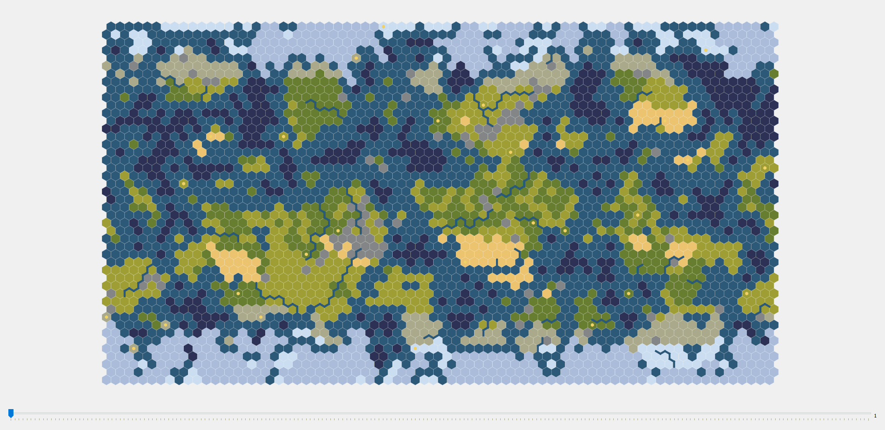

# Civ6EGRM
Civilization 6 End Game Replay Map

## Main features
- fileCopier.py which copies automatically all autosaves (Single/Multi) (not necessary if you have some other method to collect your save files)
- endGameReplay.py visualizes all separately (autosaved) data
  - Visualized environment similar to the minimap in the game
  - Civilization border colors according to the prismatic jersey mod
  - Toggle borders on/off
  - Visualized goody huts and barb camps
  - Create gif or mp4 (custom fps)
  - Civilization and City names (also custom city names)
  - City States (and their type)
  - Some localization of Civs, Leaders and Citys
  - Events:
    - Currently only War/Peace Declarations
	- In future:
	 - City info founding, razing, capturing, revolting etc...
	 - Wonders
	 - Great People
	 - Winning Condition if the game has continued at least one more turn ...
  
## Quick start
- Start game
- python runFileWatcher.py
- Stop game
- python endGameReplay.py

More detailed instruction and installation guide under
  
## Tested with
- Base game: (Single + Multi)
- Expansions: (RF + GS)
- Python 3.8.3

## Dependencies
- PyQt5
- numpy
- raw-zlib
- watchdog
- Pillow
- pygifsicle
- wget (updater for non git users)

These can be installed with pip e.g. 
> - 'pip install matplotlib'

- Other:
    - ffmpeg (to create mp4, included exe)
    - ifsicle.exe (to compress gifs) (64bit) included also

## How to
1) Start civ game
1) Start file copier (or use your own method to collect saves)
    - Set correct path to 'runFileWatcher.py' with your text editor
      - 'watchDir = os.path.expanduser("~/Documents/My Games/Sid Meier's Civilization VI/Saves/Multi/auto/")'
      - Set Multi or Single (and/or (Epic) if you don't play it via Steam)
    - Open cmd
    - 'python runFileWatcher.py'
    - Check within 10 turns that saves are going to target directory ('./data/auto/<AUTOGENERATEDFOLDER>')
    - NOT VALID ANYMORE: Remember to (re)move old autosaves from './data/auto' to somewhere else (especially if you want to continue later)
1) Stop it when you have done playing the game
    - You can continue it later, just check that './data/auto/<AUTOGENERATEDFOLDER>/' has correct files
1) Run end game replay map code
    - check that './data/auto' has correct files
    - 'python endGameReplay.py'    (runs by default files from ./data/auto) or use runEndGameReplay.bat
    - 'python endGameReplay.py -d <someDirectoryWithAutoSaves>'    (to change directory)
    - or run by double clicking 'autoRunEndGameReplayHere.bat' from './data/auto/<AUTOGENERATEDFOLDER>/'
    - Save your game as gif or mp4 (with custom fps) (endGameReplayMap.gif/mp4)
    - Share it with your friends

Any feedback or suggestions are appreciated.

## Update
1) Use git
1) or run nonGitUpdater.py (which downloads necessary files from GitHub)

## Localization
Localization is done automatically by
- 'python parseLocalization.py' but you have to set correct paths inside the code (if you have some new DLCs)
- vanillapath = os.path.expanduser("G:\SteamLibrary\steamapps\common\Sid Meier's Civilization VI\Base\Assets\Text")
- dlcpath = os.path.expanduser("G:\SteamLibrary\steamapps\common\Sid Meier's Civilization VI\DLC")

## TODOs
- Include natural wonders and other tile improvement data (some custom visualization?)

- Nice to have stuff in future:
  - Optional visualize units
  - Show disasters (e.g. meteors would be quite easy from tile data)

## Special thanks for https://github.com/lucienmaloney/civ6save-editing

## Troubleshoot
If following error at the start of endGameReplay.py file
"qt.qpa.plugin: Could not find the Qt platform plugin "windows" in ""
This application failed to start because no Qt platform plugin could be initialized. Reinstalling the application may fix this problem."
Set following entry to your system environment variable (at least one confirmed case in windows 7)
QT_PLUGIN_PATH  C:\Python38\Lib\site-packages\PyQt5\Qt\plugins  (change the path according to your installation location)

To get emoji symbols working somehow on Windows install Segoe UI Emoji Regular font (seguiemj.ttf) (from Windows 10 but Windows 7 can't show those colored)
