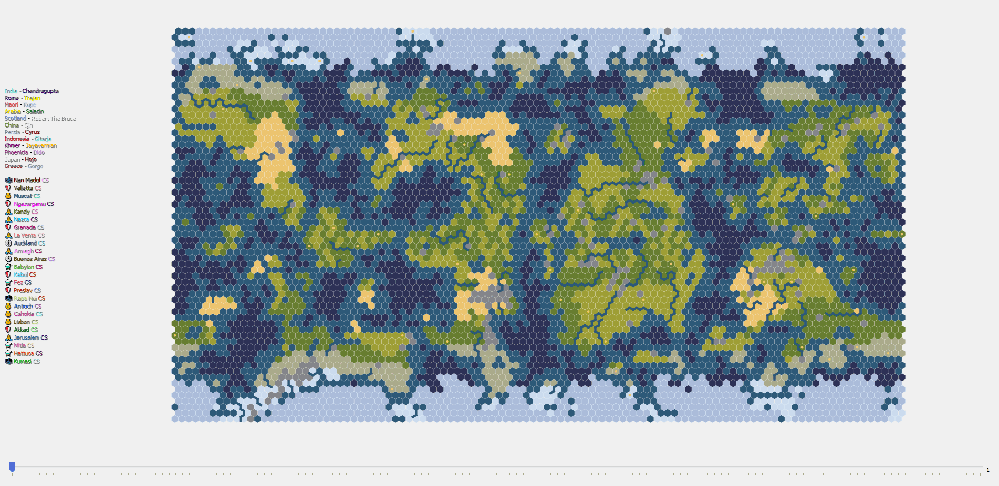

# Civ6EGRM
Civilization 6 End Game Replay Map

## Main features
- fileCopier.py which copies automatically all autosaves (Single/Multi) (not necessary if you have some other method to collect your save files)
- endGameReplay.py visualizes all separately (autosaved) data
  - Visualized environment similar to the minimap in the game
  - Toggle borders on/off
  - Visualized goody huts and barb camps
  - Create gif or mp4 (custom fps)
  
## TODOs
- Lock civ colors (and modify them away from close ocean blue or land green)
- Include natural wonders and other tile improvement data (some custom visualization?)

- Nice to have stuff in future:
  - Optional visualize units
  - Show disasters (e.g. meteors would be quite easy from tile data)
  - List events (e.g. wars, wonders, great people)

## Tested with
- Base game: (Single + Multi)
- Expansions: (RF + GS)
- Python 3.8.3

## Dependencies
- PyQt5
- numpy
- zlib
- struct
- watchdog
- shutil
- Pillow
- pygifsicle

These can be installed with pip e.g. 
> - 'pip install matplotlib'

- Other:
    - ffmpeg (to create mp4, included exe)
    - ifsicle.exe (to compress gifs) (64bit) included also

## Quickstart
1) Start civ game
1) Start file copier (set correct paths to code) (or use your own method to collect saves)
    - Open cmd
    - 'python runFileWatcher.py'
    - Remember to (re)move old autosaves from './data/auto' to somewhere else (especially if you want to continue later)
1) Stop it when you have done playing the game
    - You can continue it later, just check that './data/auto' has correct files
1) Run end game replay map code
    - 'python endGameReplay.py'
    - Save your game as gif or mp4 (with custom fps) (endGameReplayMap.gif/mp4)
    - Share it with your friends

Any feedback or suggestions are appreciated.

## Special thanks for https://github.com/lucienmaloney/civ6save-editing

